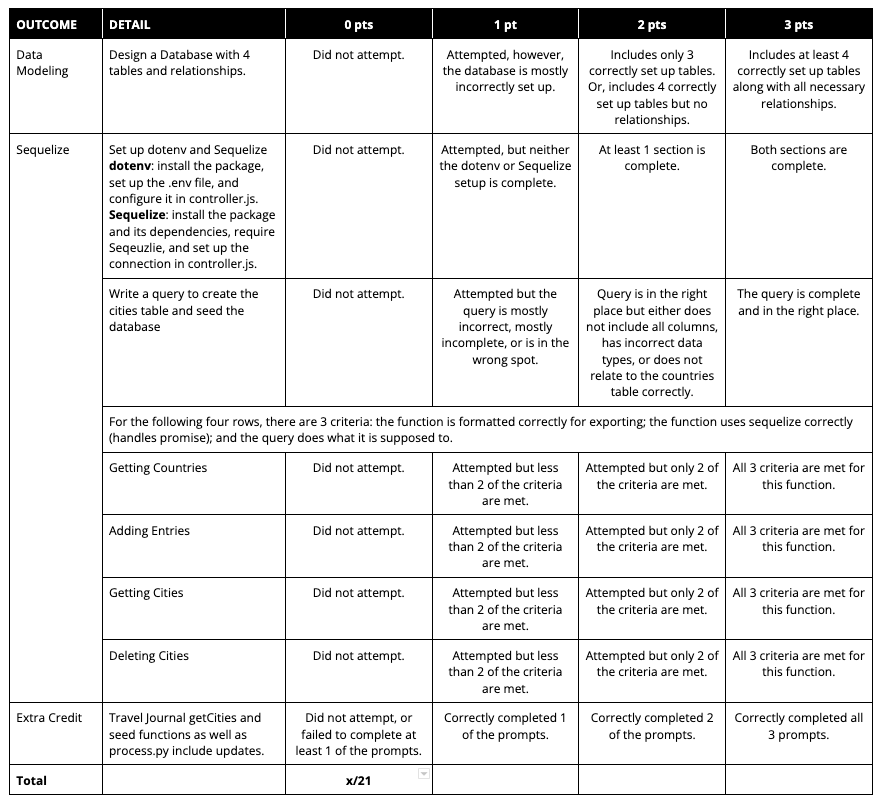

=================
Unit 5 Assessment
=================

Introduction
============

It's time to practice and solidify the skills you learned in this unit. 

Independent work
----------------
  
This is an individual assignment. Please do not collaborate with your
peers or share your work until the project is reviewed as a class.

Setup
=====

1. Download this GitHub repository.

2. Navigate to the files on the command line.

Part 1: Data Modeling
=====================

Imagine you are designing a database for an employee management app. It should keep track of employee data like phone numbers and email addresses. 
It should also keep track of which department an employee works in. And last, it should keep track of who manages who (each person can have only 1 direct manager, 
but managers can have many people on their team).

Design a database with at least 4 tables for the employee management app. 
Include any relationships between tables where you feel they are
needed. 

**Submit a diagram of your database for this project.** 

Note: Drawing Tools
-------------------

You can use `https://www.dbdesigner.net/` 
(or `https://draw.io` or `https://drawings.google.com/`) to 
create your diagram. Make sure you specify your relationships between 
tables in your diagram. 

Submitting Your Diagram
-----------------------

When you're finished with your drawing, either
take a screenshot or download a PDF of you diagram, add it to this
repository, and push it to Github. 

Part 2: Sequelize
=================

For this portion, you'll be connecting a front end to a database through a server 
and making queries using Sequelize.

The front end of the app is simple -- there is a form where you can add a book, its genre, and a rating for that book.

Setup
-----

#. Ensure you're in this project's folder in your terminal.

#. Run ``npm install`` to get the project's dependencies installed.

Step 1: Dotenv
--------------

For our server files to work, we're going to need `dotenv`.

#. Install 'dotenv' using ``npm install dotenv``

#. Create a file in the root of this directory directory called ``.env``

#. In that file, create a ``SERVER_PORT`` variable and set it to **4004** (it needs to be this number or the front end won't work)

#. Additionally, create a ``CONNECTION_STRING`` variable and set it to your `URI` from bit.io (you can use the database from your lab earlier this unit or create another)

#. At the top of ``controller.js``, require in the ``dotenv`` package and call its ``config`` method (you can ignore the other code in there until later steps)

#. Optional: destructure ``CONNECTION_STRING`` from ``process.env`` in ``controller.js``

Step 2: Sequelize
-----------------

In order to make queries to our database, we'll need Sequelize.

#. Install Sequelize and its dependencies using ``npm install sequelize pg pg-hstore``

#. In ``controller.js``, require the ``sequelize`` package and save it to a variable called `Sequelize` (we'll be working with the ``seed`` function in the next step, don't edit it yet)

#. Initialize a new Sequelize instance, passing in your connection string and an object that looks like this: 

.. code:: javascript

   {
     dialect: 'postgres', 
     dialectOptions: {
         ssl: {
             rejectUnauthorized: false
         }
     }
   }

Step 3: Seeding the Database
----------------------------

Let's take a look at the ``seed`` function. Near the top of the query, you'll see a line that says ``*****YOUR CODE HERE*****``.

#. Delete ``*****YOUR CODE HERE*****`` and replace it with a SQL query. 

#. Your query should create a table called ``books`` that has 4 columns (**Make sure you use these exact names so the front end works**): ``book_id``: serial, primary key; ``title``: varchar; ``rating``: integer; ``genre_id``: integer that should match a ``genre_id`` from the ``genres`` table.

#. Start up your backend with ``nodemon`` (make sure you're in the right directory, also you can keep it running for the duration of the assessment)

#. Open Postman and make a ``POST`` request to `http://localhost:4004/seed`. 

#. Your database should now be seeded!

Step 4: Getting Genres
----------------------

In the ``seed`` function, a list of genres was added into your database. The front end needs that list so it can populate a ``select`` element with options for the user.

#. In ``controller.js``'s export object, write a new function called ``getGenres`` (make sure it accepts ``req`` & ``res``). In the function:

   - Use ``sequelize.query`` to query your database for **all** the columns from the ``genres`` table.
   
   - Pass a callback to the ``.then()`` that looks something like the code below (you can also add a ``.catch`` if you'd like):
   
   .. code-block:: javascript
   
      (dbRes) => {
         res.status(200).send(dbRes[0])
      }

#. In ``index.js``, comment line 15 back in (this line: ``app.get('/genres', getGenres)``)

#. Open ``index.html`` (from the public folder) in your browser

#. You should be seeing a list of genres in the dropdown selector in the form! (If that's working, there will still be 2 errors in the console -- ``GET`` and a 404 -- they will get fixed shortly)

Step 5: Adding Entries
----------------------

Now you'll write the function that will let you add books to the database.

#. In ``controller.js``, write a new function called ``createBook``. In the function: 

   - Use ``sequelize.query`` to query your database to insert some data into your table. A ``title``, a ``rating``, and a 
   ``genreId`` will be sent on the ``req.body``. Write an ``insert`` statement that adds those into the database. (
      Remember to use a template string for this, and feel free to destructure the values from ``req.body`` if you'd like).
   
   - Pass a callback to the ``.then()`` that looks something like the code below (you can also add a ``.catch`` if you'd like):
   
   .. code-block:: javascript
   
      (dbRes) => {
         res.status(200).send(dbRes[0])
      }

#. In ``index.js``, comment line 18 back in (this line: ``app.post('/books', createBook)``)

#. You should now be able to add books in the browser! You can confirm this by using the form and then ``selecting`` from your DB on bit.io's site. However, they won't be showing up in your app yet, which is where the next step comes in.

Step 6: Getting Books
---------------------

You're doing great!

#. In ``controller.js``, write a new function called ``getBooks``. In the function:

   - Use ``sequelize.query`` to query your database for columns from both the ``books`` and ``genres`` tables. 
   **books**: book_id, title, rating. **genres**: genre_id, name (alias ``genre``). Make sure to spellcheck the 
   aliases as well as the column names. ``JOIN`` the tables where ``genre_id`` is equal.

      - **Hint:** you can give a column an alias using the ``AS`` keyword. Refer to 
      `this handout <https://ed.devmountain.com/materials/java28/lectures/sql-in-practice/#aliases>`_ for a refresher on aliases.

   
   - Pass a callback to the ``.then()`` that looks something like the code below (you can also add a ``.catch`` if you'd like):
   
   .. code-block:: javascript
   
      (dbRes) => {
         res.status(200).send(dbRes[0])
      }

#. In ``index.js``, comment line 19 back in (this line: ``app.get('/books', getBooks)``)

#. You should see your entries now in the browser!

Step 7: Deleting Books
----------------------

Last, let's add the ability to delete a book from our list.

#. In ``controller.js``, write a new function called ``deleteBook``. In the function: 

   - Using ``sequelize.query`` query your database to delete a book. An ``id`` will be sent on ``req.params``. 
   That will be the ``book_id`` of the book that you will delete from the ``books`` table. 
   (Remember to use a template string for this, and feel free to destructure the values from ``req.params`` 
   if you'd like).
   
   - Pass a callback to the ``.then()`` that looks something like the code below (you can also add a ``.catch`` if you'd like):
   
   .. code-block:: javascript
   
      (dbRes) => {
         res.status(200).send(dbRes[0])
      }

#. In ``index.js``, comment line 20 back in (this line: ``app.delete('/books/:id', deleteBook)``)

#. Now you can delete books!

Submitting Your Assessment
==========================

**Be sure to push your code to GitHub for this assignment and turn your link in on Frodo!**

**To pass this assessment you must score at least 15/21.**

Extra credit is not available on this version of the assessment.

